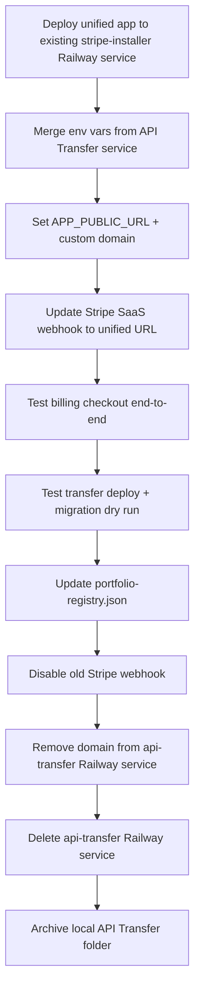

# Production cutover — one app, one domain

Use this when **Deployment & Stripe Automation Center** (this repo) replaces the two old production apps:

| Old app | Typical Railway URL | Old billing webhook |
|---------|---------------------|---------------------|
| Stripe Installer | `stripe-installer-production.up.railway.app` | `/api/v1/billing/webhook/` |
| API Transfer | `api-transfer-production.up.railway.app` | `/api/billing/webhook` |

**Target:** one Railway service, one public URL, one Stripe webhook for SaaS billing, one set of DNS records.

---

## What to keep vs delete (local)

### Keep

| Item | Why |
|------|-----|
| **`Deployment-Stripe-center/`** (this repo) | The only app you run and deploy |
| **`backend/clones/`** | Git checkouts for your client projects |
| **`~/.stripe-installer/`** | Vault master key + per-project secret backups |
| **`private_env/*.env`** | Local platform tokens (Railway, Render, GitHub, Stripe) |
| **One copy of API Transfer source** (optional) | Reference until discover/plan/Terraform are ported — pick `API Transfer` *or* `API-Transfer`, not both |

### Safe to delete (after cutover checklist below)

| Item | When |
|------|------|
| **`C:\Software Projects\API Transfer`** or **`API-Transfer`** | After unified app is live and you no longer need unported features |
| **Second duplicate checkout** | Immediately — you only need one archive copy |
| **`legacy/node/`** | Only if you never use the old CLI as reference (repo keeps it for docs) |
| **`api-transfer-legacy` entry** in `~/.stripe-installer/portfolio-registry.json` | After old Railway service is removed |

### Do not delete

- Postgres volumes on Railway until data is migrated/exported
- `VAULT_MASTER_KEY` — losing it means secrets cannot be decrypted
- Stripe products/prices — disable webhooks first, do not delete prices customers use

---

## Railway — questions to answer

Work through these in order.

### 1. Which service becomes production?

**Recommended:** keep **`stripe-installer-production`** (or rename it in Railway UI to `automation-center`) and **add API Transfer env vars** to it. Retire the separate `api-transfer-production` service.

| Question | Action |
|----------|--------|
| Do both services have Postgres? | Export data from API Transfer DB if it has users/projects you need; import into unified DB or recreate projects manually |
| Same `VAULT_MASTER_KEY` on both? | Use **one** key on the surviving service — if they differ, pick the key that decrypts your live vault and re-enter secrets for the other |
| Celery / Redis on API Transfer? | Add Redis plugin to unified service; set `REDIS_URL`, `CELERY_EAGER=false` |
| Transfer worker | Add a **second Railway service** (worker) running `npm run transfer:worker` or run worker in same container only for low volume |

### 2. Environment variables on the unified service

**Do not look for deploy tokens on api-transfer-production** — that service never had `RAILWAY_API_TOKEN`, `GITHUB_TOKEN`, etc. as Railway variables. Those credentials live in **per-project vaults** (encrypted in Postgres + local mirror under `~/.stripe-installer/projects/<slug>/`).

**Stripe-Installer already has what it needs** if `/health/` shows `vault: ok` and billing works:

| On Stripe-Installer (keep) | Notes |
|----------------------------|-------|
| `DATABASE_URL`, `DJANGO_*` | Core app |
| `STRIPE_SECRET_KEY` / `STRIPE_WEBHOOK_SECRET` | Works (aliases `SAAS_STRIPE_*`) |
| `VAULT_MASTER_KEY` | **Required** — 64-char hex; pin once |
| `CORS_ALLOWED_ORIGINS`, `CSRF_TRUSTED_ORIGINS` | Custom domain |
| `RAILWAY_PUBLIC_DOMAIN` | Auto-set (`stripe-installer.gilliomfrontlinedigital.com`) |

**Legacy names from api-transfer (safe to remove after confirming vault ok):**

| Legacy var | Unified app |
|------------|-------------|
| `VAULT_MASTER_KEY_BASE64` | Not read — use `VAULT_MASTER_KEY` |
| `VAULT_DJANGO_SECRET_KEY` | Not read — use `DJANGO_SECRET_KEY` |

**Optional — only if you want server-wide live deploy** (otherwise set per project in app vault):

```
RAILWAY_API_TOKEN          # https://railway.com/account/tokens
RAILWAY_PROJECT_ID         # auto-injected on Stripe-Installer — do not copy manually
RENDER_API_TOKEN / RENDER_OWNER_ID
FLY_API_TOKEN
GITHUB_TOKEN
ORENA_API_TOKEN
```

Keep existing Automation Center vars (do not duplicate — merge onto one service):

```
VAULT_MASTER_KEY         (must match key that decrypts live vault, or re-enter secrets)
DJANGO_SECRET_KEY
DATABASE_URL
SAAS_STRIPE_SECRET_KEY   (or STRIPE_SECRET_KEY)
SAAS_STRIPE_WEBHOOK_SECRET (or STRIPE_WEBHOOK_SECRET)
SAAS_STRIPE_PRICE_*
APP_PUBLIC_URL           (auto from RAILWAY_PUBLIC_DOMAIN when custom domain set)
```

Remove dev-only vars from Railway (see [RAILWAY.md](RAILWAY.md)).

### 3. Custom domain

| Step | Detail |
|------|--------|
| Pick canonical URL | e.g. `https://app.yourdomain.com` or keep `*.up.railway.app` for now |
| Railway Networking | Attach custom domain to **unified** web service only |
| Set `APP_PUBLIC_URL` | `https://app.yourdomain.com` — drives billing return URL and CORS |
| Retire old domains | Remove custom domains from **api-transfer** service before deleting it |

### 4. Decommission API Transfer Railway service

Only after:

- [ ] Unified service health: `GET /health/` → `"status":"ok"`
- [ ] Login + project list works
- [ ] Transfer deploy tested on a project
- [ ] Render→Railway migration tested (dry run then live)
- [ ] No traffic on old URL for 48h (check Railway metrics)

Then: stop deploys → remove custom domain → delete service (keep Postgres snapshot export first if needed).

---

## Stripe — questions to answer

You likely have **two webhook endpoints** and possibly **two sets of SaaS billing config**.

### 1. SaaS billing (this platform’s own subscriptions)

Unified app expects:

| Setting | Value |
|---------|-------|
| Webhook URL | `https://<your-domain>/api/v1/billing/webhook/` |
| Signing secret | `SAAS_STRIPE_WEBHOOK_SECRET` in Railway |
| API key | `SAAS_STRIPE_SECRET_KEY` in Railway |

**Questions:**

| Question | Fix |
|----------|-----|
| Webhook still pointing at `api-transfer-production.../api/billing/webhook`? | **Disable or delete** that endpoint in Stripe Dashboard after unified webhook succeeds |
| Two endpoints receiving `checkout.session.completed`? | Duplicate events → disable old endpoint first, verify unified webhook deliveries |
| `SAAS_STRIPE_PRICE_*` only on one Railway service? | Copy all price IDs to unified service env |
| Checkout return URL still localhost? | Set `APP_PUBLIC_URL` on Railway — billing return URL follows it |

### 2. Client project Stripe keys (vault)

Not affected by app rename. Each **Project** vault holds `STRIPE_SECRET_KEY`, `STRIPE_WEBHOOK_SECRET`, etc.

**Questions:**

| Question | Fix |
|----------|-----|
| Client webhooks point at client app URL, not Automation Center? | No change — unless you used Automation Center URL as webhook target |
| Portfolio audit expects old `stripe-installer` URL? | Update `~/.stripe-installer/portfolio-registry.json` → one `automation-center` entry with correct `productionUrl` |
| Old API Transfer used different webhook path (`/api/billing/webhook` vs `/api/v1/billing/webhook/`)? | Unified app uses **`/api/v1/billing/webhook/`** only for **SaaS** billing |

### 3. Stripe Dashboard checklist

- [ ] One live webhook for SaaS billing → unified URL
- [ ] Test webhook → 200 OK in Stripe Dashboard
- [ ] Old API Transfer webhook **disabled**
- [ ] Products/prices unchanged (same IDs in env vars)
- [ ] Restricted API key (`rk_`) recommended for production if not already

---

## Domain & DNS — questions to answer

| Record / setting | Old state | Target state |
|------------------|-----------|--------------|
| `app.yourdomain.com` | CNAME → Stripe Installer or API Transfer | CNAME → **unified** Railway service |
| Second subdomain for API Transfer | e.g. `transfer.yourdomain.com` | Redirect to unified app or remove |
| GitHub App callback URL | May list old host | Update to unified `APP_PUBLIC_URL` + `/api/v1/webhooks/github/` |
| Stripe webhook URL | Two hosts possible | One host only |

**Questions:**

| Question | Fix |
|----------|-----|
| Which domain do users bookmark? | Pick one; 301 redirect old host to new if both had custom domains |
| SSL on old service? | Remove domain from old Railway service before delete to avoid cert confusion |
| Email links / invites | Search codebase env for hardcoded URLs; set `APP_PUBLIC_URL` |

---

## Database & users

| Question | Action |
|----------|--------|
| Users only on Stripe Installer DB? | No user migration needed |
| Users on both apps? | Export API Transfer users or ask them to re-register on unified app |
| Projects in both? | Recreate projects or SQL export — models differ (`Workspace` → `Organization`) |
| Vault secrets | Re-import from `~/.stripe-installer/projects/` via app **Import** if DB was reset |

---

## Cutover sequence (recommended order)



---

## After cutover — local cleanup

1. Update `~/.stripe-installer/portfolio-registry.json` — remove `api-transfer-legacy` entry (template in repo uses `automation-center` id).
2. Delete duplicate `API-Transfer` folder if you kept `API Transfer`.
3. Run portfolio audit: `python manage.py stripe_installer portfolio-audit --project stripe-installer`
4. Confirm `backend/clones/` still resolves for each project slug in Settings.

---

## Build status (code merge)

**Done in unified app:** deploy pipeline, GitHub import, Render→Railway runs, worker, project Transfer UI, audit log, metrics, platform setup audit.

**Not done yet:** discover/plan/apply, Terraform, console bootstrap, client prewire, full test port.

You can cut over production **before** those are done if you do not rely on them daily. Keep one API Transfer folder archived until Terraform/prewire are ported or explicitly dropped.

---

## Related docs

- [RAILWAY.md](RAILWAY.md) — env vars, health, 502 troubleshooting
- [PRODUCTION.md](PRODUCTION.md) — Docker prod stack
- [GO-LIVE.md](GO-LIVE.md) — client project go-live
- [AUTOMATION-CENTER.md](AUTOMATION-CENTER.md) — merge architecture
- [PORTFOLIO-AUDIT.md](PORTFOLIO-AUDIT.md) — webhook audit across your apps

---

## Gilliom setup — Railway + Porkbun + gilliomfrontlinedigital.com

### Portfolio architecture (how apps are linked)

**[gilliomfrontlinedigital.com](https://gilliomfrontlinedigital.com/)** is your **portfolio / marketing site** — not the host for Stripe Installer or API Transfer. It lists products under **Projects** with **Live demo** buttons that open **separate Railway URLs**.

```
Porkbun DNS
  gilliomfrontlinedigital.com  ──►  Railway: frontlinedigital-1-production  (DevCollective SPA)
                                           │
                                           └── Project cards → Live demo links (external)
                                                 ├── stripe-installer-production.up.railway.app/login
                                                 ├── api-transfer-production.up.railway.app
                                                 ├── kistie-store-production.up.railway.app
                                                 └── … (portfolioLiveUrls.ts)
```

**Source of truth for demo buttons:**

`FrontlineDigital/DevCollective/frontend/src/data/portfolioLiveUrls.ts`

Also documented in `FrontlineDigital/DevCollective/README.md` (Live Demo table).

**Stripe Installer local audit registry** (separate file, your PC only):

`~/.stripe-installer/portfolio-registry.json` — maps app IDs → `productionUrl`, `webhookPath`, `projectSlug` for webhook audits. Must stay in sync with live Railway URLs.

| Layer | What it links | File / location |
|-------|----------------|-----------------|
| Public portfolio | Live demo buttons | `portfolioLiveUrls.ts` |
| Automation Center audit | Stripe webhooks vs live URLs | `portfolio-registry.json` |
| Per client project | Client app production URL | Project settings / `deploy.config.json` |

**Do not** point `gilliomfrontlinedigital.com` at Stripe Installer unless you intentionally replace the portfolio site with the product.

### Porkbun DNS (marketing site only)

In **Porkbun → gilliomfrontlinedigital.com → DNS**:

| Record | Typical target | Purpose |
|--------|----------------|---------|
| `@` / `www` | `frontlinedigital-1-production.up.railway.app` (CNAME/ALIAS) | Portfolio site |

If the portfolio returns **502**, attach the custom domain to **FrontLineDigital-1** in Railway (not a crashed duplicate service). See `FrontlineDigital/DevCollective/README.md` deployment section.

Demo apps use **Railway default hostnames** in `portfolioLiveUrls.ts` — no Porkbun subdomain required per app unless you add custom domains later.

### Merging Stripe Installer + API Transfer (Railway)

| Step | Action |
|------|--------|
| 1 | Keep **`stripe-installer-production`** Railway service; merge API Transfer env vars |
| 2 | Retire **`api-transfer-production`** after unified app is verified |
| 3 | Update **`portfolioLiveUrls.stripeInstaller`** — same unified `/login` URL |
| 4 | Update **`portfolioLiveUrls.apiTransfer`** → same URL as step 3, or remove duplicate portfolio card |
| 5 | Redeploy **FrontlineDigital** frontend so Live demo buttons match |
| 6 | Update **`portfolio-registry.json`** — one `automation-center` entry; remove `api-transfer-legacy` |
| 7 | Stripe Dashboard — one SaaS webhook on unified service (see below) |

Optional: add a custom domain on the **unified product** Railway service (e.g. `tools.gilliomfrontlinedigital.com`) — then update `portfolioLiveUrls` and `APP_PUBLIC_URL`. The portfolio root domain can stay as-is.

### Stripe webhooks (unified product service)

| Endpoint | URL |
|----------|-----|
| **Keep** | `https://stripe-installer-production.up.railway.app/api/v1/billing/webhook/` (or custom domain when set) |
| **Disable** | `https://api-transfer-production.up.railway.app/api/billing/webhook` |

Client project webhooks (Kistie, RigHand, etc.) stay on **their** Railway URLs — unchanged by this merge.

### Railway env (unified automation service)

```env
APP_PUBLIC_URL=https://stripe-installer-production.up.railway.app
# or custom domain when you add one:
# APP_PUBLIC_URL=https://tools.gilliomfrontlinedigital.com
DJANGO_ALLOWED_HOSTS=stripe-installer-production.up.railway.app,.railway.app,.up.railway.app
```

Verify:

```bash
curl https://stripe-installer-production.up.railway.app/health/
```

### What you can delete when done

| Delete | Keep |
|--------|------|
| `api-transfer-production` Railway service | `frontlinedigital-1-production` (portfolio) |
| `api-transfer` portfolio card or duplicate demo URL | `portfolioLiveUrls.ts` with updated unified URL |
| Old Stripe webhook for API Transfer | Portfolio Porkbun DNS for `@` |
| Local duplicate `API-Transfer` folder | `Deployment-Stripe-center` + `backend/clones/` |
